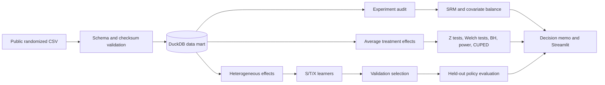
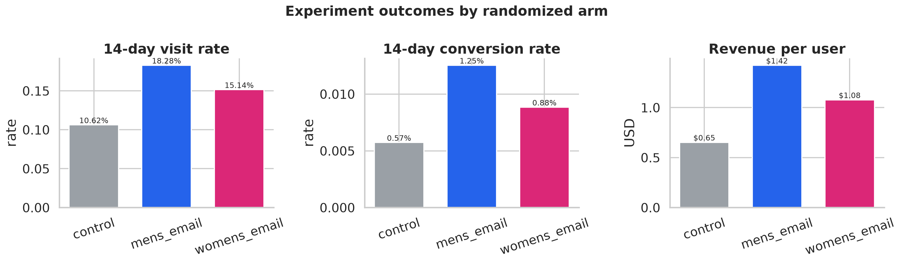
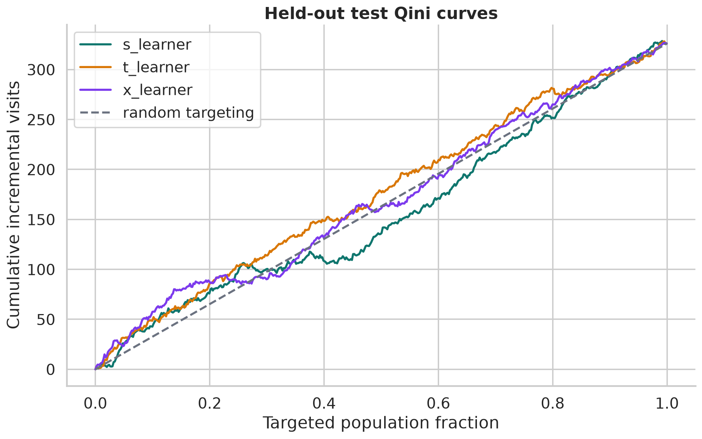

# Growth Experimentation & Causal Uplift Lab

[](https://github.com/Jacob-Zjy/growth-experimentation-uplift/actions/workflows/ci.yml)
[](https://www.python.org/)
[](LICENSE)

An end-to-end data science project for two product questions:

1. Did a randomized campaign create incremental impact?
2. Which eligible users should be contacted because treatment changes their behavior?

The repository combines SQL metric marts, experiment diagnostics, statistical inference,
CUPED, heterogeneous treatment-effect models, offline policy evaluation, and a Streamlit
decision dashboard.

[中文复现指南](docs/README_CN.md)

> The dataset is a public historical email experiment. This project does not use or claim
> to represent data from ByteDance, Tencent, Xiaohongshu, or any other employer.

## What this project demonstrates

- DuckDB and SQL data modeling with explicit table grain and metric definitions
- sample-ratio-mismatch and pre-treatment balance checks before outcome analysis
- multi-arm A/B analysis with confidence intervals and Benjamini-Hochberg correction
- power analysis, minimum detectable effects, and CUPED variance reduction
- independent S-, T-, and X-learner implementations with scikit-learn
- strict 60/20/20 splitting: validation selects model and targeting share; test evaluates once
- Qini, AUUC, and inverse-propensity offline policy evaluation
- configurable value and contact-cost assumptions
- a stakeholder dashboard, generated decision memo, automated tests, and GitHub Actions

## Analytical architecture



## Verified public-data results

These values are generated by the reproducible pipeline on the 64,000-row public dataset.
The checked-in run manifest records `"synthetic": false`.

| Check or decision | Verified result |
|---|---:|
| Analyzed users | 64,000 |
| SRM p-value / maximum absolute SMD | 0.9037 / 0.016 |
| Men's email visit lift vs control | +7.66 pp (95% CI 7.00-8.32 pp) |
| Men's email conversion lift vs control | +0.68 pp (95% CI 0.50-0.86 pp) |
| Men's email revenue lift vs control | +$0.770 per eligible user (95% CI $0.485-$1.055) |
| MDE at 80% power | 0.85 pp visits / 0.22 pp conversion |
| CUPED variance reduction | 0.05%-0.06% |
| Validation-selected uplift model | X-learner |
| Held-out top-decile visit uplift | 12.85 pp, versus 7.66 pp overall |
| Illustrative offline policy | Validation selects 2%; fixed held-out net value is $44.55 |

The 2% targeting share uses the default scenario of $5 per incremental visit and $0.50
per contacted user. The $44.55 held-out value is a model-based offline estimate, not
realized profit. Production deployment would require a new randomized holdout.

## Quick start

Requirements:

- Python 3.10 or later
- internet access for the first public-data download
- no external database server; DuckDB runs locally

### Windows PowerShell

```powershell
git clone https://github.com/Jacob-Zjy/growth-experimentation-uplift.git
cd growth-experimentation-uplift
Set-ExecutionPolicy -Scope Process Bypass
.\scripts\setup.ps1
.\.venv\Scripts\python.exe scripts\run_pipeline.py
.\.venv\Scripts\streamlit.exe run app\streamlit_app.py
```

Open the local URL printed by Streamlit, usually `http://localhost:8501`.

### macOS/Linux

```bash
git clone https://github.com/Jacob-Zjy/growth-experimentation-uplift.git
cd growth-experimentation-uplift
python -m venv .venv
source .venv/bin/activate
python -m pip install --upgrade pip
python -m pip install -e ".[dev]"
python scripts/run_pipeline.py
streamlit run app/streamlit_app.py
```

Conda users can instead run:

```bash
conda env create -f environment.yml
conda activate growth-experimentation-uplift
python scripts/run_pipeline.py
```

## Configuration

| Argument | Default | Purpose |
|---|---:|---|
| `--synthetic` | off | Deterministic, network-free smoke test |
| `--force-download` | off | Re-download the public CSV and verify its MD5 |
| `--value-per-incremental-visit` | `5.0` | Scenario value assigned to one incremental visit |
| `--contact-cost` | `0.50` | Delivery plus opportunity cost per contacted user |

Example with different economics:

```bash
python scripts/run_pipeline.py --value-per-incremental-visit 8 --contact-cost 0.75
```

Network-free smoke test:

```bash
python scripts/run_pipeline.py --synthetic
```

Synthetic output is for checking code execution only and must not be presented as a
substantive experiment result. `artifacts/run_manifest.json` records the data mode and
economic assumptions used for every run.

## Generated outputs

A full run creates:

- `artifacts/experiment_decision_memo.md`
- `artifacts/run_manifest.json`
- summary tables in `artifacts/metrics/*.csv`
- figures in `artifacts/figures/*.png`
- a local DuckDB mart in `data/processed/`
- row-level scored samples in `artifacts/metrics/`
- a serialized uplift model in `models/`

Only aggregate, reviewable outputs are committed. Raw data, local databases, row-level
scores, secrets, and serialized models are ignored by Git.





## Test and quality gates

```bash
ruff check src tests scripts app
pytest
```

GitHub Actions runs the same checks on pushes and pull requests. The integration test uses
synthetic data so CI does not depend on the upstream download server.

## Repository structure

```text
.
├── app/                         # Streamlit decision dashboard
├── artifacts/                   # Aggregate metrics, figures, memo, and run manifest
├── data/                        # Downloaded/processed data; contents excluded from Git
├── docs/                        # Public design, methodology, and Chinese reproduction guide
├── models/                      # Serialized models; excluded from Git
├── scripts/                     # Setup and pipeline entry points
├── sql/                         # Data mart and business metric queries
├── src/growth_lab/              # Reusable Python package
├── tests/                       # Unit and integration tests
├── .github/workflows/ci.yml
├── pyproject.toml
└── requirements.txt
```

Main entry points:

- `scripts/run_pipeline.py`: reproducible command-line workflow
- `src/growth_lab/pipeline.py`: pipeline orchestration
- `sql/01_build_mart.sql`: analytical mart construction
- `src/growth_lab/experiment.py`: experiment diagnostics and inference
- `src/growth_lab/uplift.py`: uplift learners and policy evaluation
- `app/streamlit_app.py`: interactive decision dashboard

## Public documentation

- [Experiment design and pre-analysis contract](docs/experiment_design.md)
- [Statistical and causal methodology](docs/methodology.md)
- [Data dictionary](docs/data_dictionary.md)
- [中文安装、配置与复现指南](docs/README_CN.md)
- [Data source and redistribution notice](NOTICE.md)
- [Contribution guide](CONTRIBUTING.md)

## Data

The project uses the
[MineThatData E-Mail Analytics and Data Mining Challenge](https://blog.minethatdata.com/2008/03/minethatdata-e-mail-analytics-and-data.html):
64,000 customers randomized to a men's email, a women's email, or no email, with visits,
conversions, and spend observed for two weeks.

The downloader uses the public mirror referenced by scikit-uplift and verifies the
published MD5 checksum. The raw CSV is never committed. The upstream dataset has no formal
license statement; see [NOTICE.md](NOTICE.md).

## Statistical contract

- Primary business metric: revenue per eligible user over 14 days
- Diagnostic metrics: visit rate and conversion rate
- Experiment integrity: SRM at 1%; absolute SMD below 0.10
- Pairwise tests: two-proportion Z tests and Welch tests
- Multiplicity: Benjamini-Hochberg across nine planned arm-metric contrasts
- Estimand: intent-to-treat effect
- Heterogeneity: exploratory until confirmed prospectively
- Uplift target: visits, because conversion is too sparse for stable ranking

## Limitations

1. Historical retail email data may not generalize to modern content or social products.
2. The two-week observation window cannot identify delayed effects.
3. CUPED helps only when available pre-treatment covariates predict the outcome.
4. Qini measures ranking quality, not individual causal truth or calibrated uplift.
5. Policy value depends on explicit scenario economics and must be validated online.
6. This is an analytical prototype, not a production campaign system.

## Troubleshooting

- If the download fails, check internet access and retry with `--force-download`.
- If the checksum fails, delete only the downloaded CSV in `data/raw/` and run again.
- If `streamlit` is not found, use the executable inside `.venv` as shown above.
- If results differ, confirm Python/package versions and inspect `run_manifest.json`.
- Never commit `.env`, `.streamlit/secrets.toml`, raw data, or row-level user scores.

## References

- Hillstrom, K. (2008), MineThatData E-Mail Analytics and Data Mining Challenge.
- Deng, A. et al. (2013), [Improving the Sensitivity of Online Controlled Experiments by Utilizing Pre-Experiment Data](https://www.microsoft.com/en-us/research/wp-content/uploads/2016/02/exp-tricks.pdf).
- Künzel, S. et al. (2019), [Metalearners for estimating heterogeneous treatment effects](https://doi.org/10.1073/pnas.1804597116).
- Gutierrez, P. and Gérardy, J.-Y. (2017), [Causal Inference and Uplift Modelling](https://proceedings.mlr.press/v67/gutierrez17a.html).
- Benjamini, Y. and Hochberg, Y. (1995), [Controlling the False Discovery Rate](https://doi.org/10.1111/j.2517-6161.1995.tb02031.x).

## License

Original source code is MIT licensed. The upstream dataset is not included in that license
and is not redistributed here.
